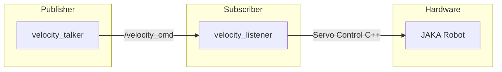

# JAKA 机械臂速度控制接口


## 项目简介

本项目基于 ROS 消息机制，实现了对 JAKA (节卡) 机械臂的速度控制功能。

由于 JAKA SDK 原生主要提供位置控制与伺服接口，本项目通过速度积分算法，将上层发布的速度指令实时转换为关节角度增量，调用底层伺服接口，实现从速度控制到位移控制闭环转换。

## 系统架构


## 文件说明

本功能包包含以下核心源文件：

| 文件名 | 功能描述 |
| :--- | :--- |
| **`src/jakatest.cpp`** | **主控制节点**<br>1. 负责机械臂的连接、上电及使能。<br>2. 订阅 `/velocity_cmd` 话题，接收速度指令。<br>3. 对速度进行数值积分，计算目标关节位移。<br>4. 调用 JAKA 伺服接口下发控制量。<br>5. 发布期望位移与真实位移数据（用于调试与分析）。 |
| **`src/talker.cpp`** | **速度发布节点**<br>1. 启动 `velocity_talker` 节点。<br>2. 向 `/velocity_cmd` 话题发布关节速度指令。 |

## 依赖环境

*   Ubuntu 20.04
*   ROS Noetic
*   JAKA Robot SDK (需自行配置)
*   C++11 及以上

## 运行

1.  编译工作空间
    ```bash
    cd ~/catkin_ws
    catkin_make
    source devel/setup.bash
    ```

2.  启动主控制节点  
    ```bash
    rosrun jaka_velocity_control jakatest
    ```

3.  启动速度发布节点
    ```bash
    rosrun jaka_velocity_control talker
    ```

## 测试结果

下图展示了机械臂某关节的**期望位移**（灰色）与**实际位移**（蓝色）对比曲线。
*   **期望位移**：通过对发布的速度指令进行积分获得。
*   **实际位移**：通过机器人电控柜实时读取。


## 注意事项与技术细节

### 1. 线程模型与控制稳定性

代码默认采用单线程处理速度读取、积分运算及控制下发。虽然肉眼观察机械臂运行平稳，但在高频数据采集下（如上图蓝色曲线），实际位移会出现尖刺。

原因分析： 读取关节状态（`get_robot_status`）占用的时间阻塞了控制循环，导致控制周期不稳定。

优化方案： 在实际测试中，建议采用多线程分离策略：
*   线程 A：专门负责下发控制量。
*   线程 B：专门负责读取并发布真实位移。
*   线程 C：专门负责发布期望值。
  
该方案可有效消除尖峰，获得平滑的控制曲线。

### 2. 关节角度读取方式的选择
JAKA SDK 提供了两种读取关节角度的方式，在伺服控制循环中，务必使用 `get_robot_status(&status)` 来获取当前关节角度。

| API 函数 | 数据来源 | 对伺服控制的影响 |
| :--- | :--- | :--- |
| `get_robot_status()` | 控制器 (Controller) | 无影响。仅读取控制器状态缓存。 |
| `get_joint_position()` | 伺服电机 (Servo Motor) | 干扰。直接访问电机会占用通信带宽，导致伺服抖动。 |


## License

本项目基于 [LICENSE](https://github.com/Haoyi-SJTU/jaka_velocity/blob/main/LICENSE) 许可证开源。

---

# JAKA Manipulator Velocity Control Interface


## Project Introduction

This project implements velocity control for the JAKA manipulator based on the ROS message mechanism.

Since the native JAKA SDK primarily provides position control and servo interfaces, this project utilizes a velocity integration algorithm. It converts the velocity commands published by the upper layer into joint angle increments in real-time and calls the underlying servo interface. This achieves a closed-loop conversion from velocity control to displacement control.

## System Architecture


## File Description

This package contains the following core source files:

| Filename | Function Description |
| :--- | :--- |
| **`src/jakatest.cpp`** | **Main Control Node**<br>1. Handles the connection, power-on, and enabling of the manipulator.<br>2. Subscribes to the `/velocity_cmd` topic to receive velocity commands.<br>3. Performs numerical integration on the velocity to calculate the target joint displacement.<br>4. Calls the JAKA servo interface to send control commands.<br>5. Publishes desired displacement and actual displacement data (for debugging and analysis). |
| **`src/talker.cpp`** | **Velocity Publisher Node**<br>1. Launches the `velocity_talker` node.<br>2. Publishes joint velocity commands to the `/velocity_cmd` topic. |

## Dependencies

*   Ubuntu 20.04
*   ROS Noetic
*   JAKA Robot SDK (needs to be configured manually)
*   C++11 or higher

## Execution

1.  Compile the workspace
    ```bash
    cd ~/catkin_ws
    catkin_make
    source devel/setup.bash
    ```

2.  Start the main control node  
    ```bash
    rosrun jaka_velocity_control jakatest
    ```

3.  Start the velocity publisher node
    ```bash
    rosrun jaka_velocity_control talker
    ```

## Test Results

The figure below shows the comparison curve between the **desired displacement** (gray) and the **actual displacement** (blue) of a joint on the manipulator.
*   **Desired Displacement**: Obtained by integrating the published velocity command.
*   **Actual Displacement**: Read in real-time from the robot controller.


## Notes & Technical Details

### 1. Thread Model & Control Stability

The code uses a single thread by default to handle status reading, integration calculation, and command sending. Although the manipulator appears smooth to the naked eye, high-frequency data collection (as shown by the blue curve in the figure above) reveals spikes in the actual displacement.

**Analysis:** The time taken to read the joint status (`get_robot_status`) blocks the control loop, causing instability in the control cycle.

**Optimization:** In practical testing, it is recommended to use a multi-threaded separation strategy:
*   Thread A: Dedicated to sending control commands.
*   Thread B: Dedicated to reading and publishing actual displacement.
*   Thread C: Dedicated to publishing desired values.

This solution effectively eliminates the spikes and yields a smooth control curve.

### 2. Selection of Joint Angle Reading Method
The JAKA SDK provides two methods to read joint angles. In the servo control loop, **`get_robot_status(&status)`** must be used to obtain the current joint angle.

| API Function | Data Source | Impact on Servo Control |
| :--- | :--- | :--- |
| `get_robot_status()` | Controller | No impact. Reads only from the controller's status cache. |
| `get_joint_position()` | Servo Motor | Interference. Direct access to the motor occupies communication bandwidth, causing servo jitter. |

## License

This project is open-source under the [LICENSE](https://github.com/Haoyi-SJTU/jaka_velocity/blob/main/LICENSE).
